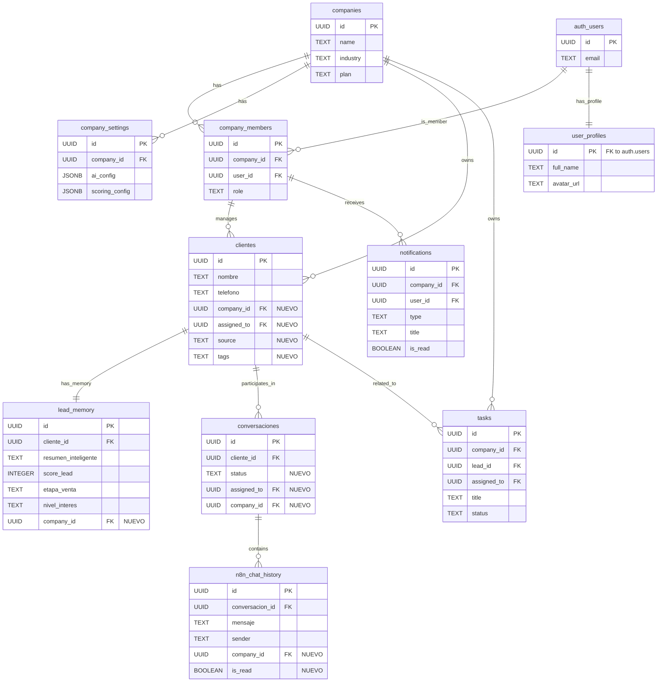

# FAIREX DATABASE BLUEPRINT V1

> **Objetivo:** Definir la arquitectura de datos exacta para la V2 de FAIREX, garantizando soporte multiempresa y la convivencia armónica entre el Frontend Next.js y el motor n8n/IA existente, sin romper la compatibilidad actual.

A continuación, presento el blueprint detallado respondiendo a cada uno de los 10 puntos requeridos.

---

## 1. Diagrama Completo de Tablas

---

## 2. Relaciones entre Tablas

Las relaciones se estructuran bajo un modelo de **Silo Lógico Multiempresa (Tenancy)**:

*   **Raíz Multi-Tenant:** La tabla `companies` es el nodo principal. Casi todas las tablas transaccionales tienen una clave foránea `company_id`.
*   **Usuarios y Empresas:** Un usuario de Supabase (`auth.users`) tiene un `user_profile` (datos estéticos) y se enlaza a empresas a través de `company_members` (donde adquiere su rol: owner, director, vendedor).
*   **CRM Relacional:**
    *   Un cliente (lead) pertenece a una empresa (`company_id`) y puede estar asignado a un vendedor en específico (`assigned_to` referenciando `company_members.id`).
    *   El `cliente` tiene una relación 1:1 con `lead_memory` (el cerebro de IA para ese cliente).
    *   Un `cliente` tiene una relación 1:N con `conversaciones`.
*   **Mensajería:** `conversaciones` agrupa 1:N mensajes crudos en `n8n_chat_history`.

---

## 3. Tablas Nuevas a Crear

Para el MVP de FAIREX V2, se crearán **6 tablas nuevas** que NO interferirán con el ecosistema de n8n:

1.  `companies`: Registro de empresas (tenants).
2.  `company_members`: Controla qué usuario pertenece a qué empresa y su rol.
3.  `user_profiles`: Datos extendidos del usuario (nombre completo, foto), complementando `auth.users`.
4.  `tasks`: Sistema de tareas manuales o sugeridas para los vendedores.
5.  `notifications`: Alertas in-app (leads calientes, mensajes nuevos).
6.  `company_settings`: Configuraciones granulares por empresa (colores, umbrales de scoring).

---

## 4. Columnas Nuevas a Agregar

Se aplicará un `ALTER TABLE` a las tablas existentes para soportar el nuevo Frontend y Multiempresa:

*   **En `clientes`**: `company_id` (UUID), `assigned_to` (UUID), `source` (TEXT), `tags` (TEXT[]), `valor_estimado` (DECIMAL).
*   **En `lead_memory`**: `company_id` (UUID). *(Posible `ultima_accion` y `motivo_perdida` si n8n no los gestiona).*
*   **En `conversaciones`**: `company_id` (UUID), `assigned_to` (UUID), `status` (TEXT), `unread_count` (INTEGER), `last_message_at` (TIMESTAMPTZ).
*   **En `n8n_chat_history`**: `company_id` (UUID), `is_read` (BOOLEAN).

> [!IMPORTANT]
> Todas estas columnas nuevas serán `NULLABLE` (opcionales) o tendrán un valor `DEFAULT`. Esto es obligatorio para que los flujos de n8n sigan haciendo `INSERT` de la misma manera que hoy, sin fallar.

---

## 5. Relación con las Tablas Core Actuales

Las tablas core (controladas hoy por n8n) se convierten en el centro de la aplicación Frontend:

*   **clientes**: Sigue siendo el directorio principal. El frontend solo agregará campos operativos humanos (quién lo atiende, etiquetas).
*   **lead_memory**: Es el cerebro. El Frontend consumirá los datos de esta tabla para alimentar los Dashboards Ejecutivos, pintar los scores, y dibujar el Kanban (basado en `etapa_venta`).
*   **conversaciones**: Agrupará las sesiones. El Frontend consumirá esta tabla para pintar la lista de "Inbox" del vendedor, y modificará su estado (leído/no leído, cerrado/abierto).
*   **n8n_chat_history**: Historial bruto de mensajes. El Frontend escuchará esta tabla en tiempo real (Supabase Realtime) para actualizar la burbuja del chat al instante.

---

## 6. Qué Tablas Serán Solamente Lectura (Para el Frontend)

*   `n8n_chat_history` (100% de Solo Lectura. El Frontend NUNCA escribe mensajes aquí directamente, esos los graba n8n).
*   Campos de IA en `lead_memory` (`resumen_inteligente`, `score_lead`, `nivel_interes`, `objeciones`, `necesidades`, campos de followup).

---

## 7. Qué Tablas Podrá Modificar el Frontend

*   **Todas las Tablas Nuevas:** `companies`, `company_members`, `user_profiles`, `tasks`, `notifications`, `company_settings`.
*   **Tablas Existentes (Modificaciones Específicas Operativas):**
    *   `clientes`: Solo mutar campos `assigned_to`, `tags`, `valor_estimado`, `source`.
    *   `conversaciones`: Solo mutar `status`, `assigned_to`, `unread_count`.
    *   `lead_memory`: **ÚNICA EXCEPCIÓN**: Mutar el campo `etapa_venta` en caso de que el vendedor mueva visualmente la tarjeta de columna en el Pipeline/Kanban.

---

## 8. Qué Tablas Seguirá Controlando Exclusivamente n8n

> [!CAUTION]
> El Frontend JAMÁS debe interferir con las operaciones de escritura que hace la inteligencia artificial.

*   **`n8n_chat_history`**: Las inserciones de mensajes nuevos entrantes y salientes las hace únicamente n8n.
*   **Cerebro IA de `lead_memory`**: Campos clave como `score_lead`, `resumen_inteligente`, `objeciones`, `necesidades`, extracciones del bot y programación de retargeting/followup siguen siendo reescritos exclusivamente por la evaluación de los Agentes de OpenAI mediante n8n.

---

## 9. Estrategia Exacta para Multiempresa

El modelo Multi-tenant utilizará **Row Level Security (RLS)** de PostgreSQL en Supabase.

1.  **Migración del Cliente Cero:** Una vez creadas las tablas `companies`, se insertará un registro correspondiente a la "Empresa Principal" (El FAIREX actual).
2.  **Llenado de Datos Históricos:** Se ejecutará un script SQL (Update Masivo) que asignará el `company_id` de la "Empresa Principal" a todas las filas que ya existen en `clientes`, `lead_memory`, `conversaciones` y `n8n_chat_history`.
3.  **Aislamiento de Datos:** Las políticas (Policies) en Supabase verificarán en cada request si el `auth.uid()` del usuario existe en `company_members` para la empresa a la que está intentando acceder, garantizando que nadie pueda ver u operar datos de otros Tenants.

---

## 10. Estrategia Exacta para NO Romper Workflows Existentes

El secreto de la compatibilidad 100% es el tratamiento pasivo de la base de datos para la ingesta desde n8n:

1.  **Columnas Nullable o Default:** Los nodos de PostgreSQL en n8n no saben qué es `company_id`. Para que un `INSERT` de n8n no truene por culpa del constraint multiempresa, la base de datos se configurará con un `DEFAULT` a nivel Postgres que asigne los inserts sin `company_id` automáticamente al tenant principal (o se pueden adaptar triggers de DB). De esta forma, **n8n no requiere ni un solo cambio en sus nodos SQL.**
2.  **Principio de Inmutabilidad Analítica:** El frontend está diseñado bajo el patrón *Read-Model* sobre los datos de IA. El frontend toma lo que hay en `lead_memory` y lo pinta bonito (tarjetas de resumen, alertas rojas si el score es > 90). Pero no calcula ni recalcula nada de IA.
3.  **Respuestas Humanas (Hybrid Chat):** Si el Frontend necesita enviar un mensaje como humano, no escribirá en la tabla de chat directamente ni usará la API de WhatsApp directa (lo que rompería el seguimiento de n8n). En cambio, el Frontend detonará un Webhook especial a n8n ("Manual Reply Trigger"), y será n8n quien envíe el mensaje vía WhatsApp Business API y registre dicho mensaje en la DB, manteniendo el ciclo de vida natural y coherente.
